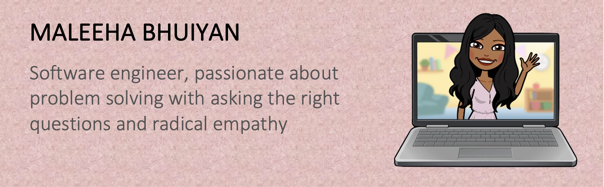

<link href="style.css" rel="stylesheet"></link>

### Hello, I'm Maleeha 👋

    

    I am a software engineer who has recently graduated from Baruch college with a Bachelor's degree in Computer Information Systems and a minor in Anthropology. I have also worked in the education field for three years. My unique background contributes to my problem solving approach in web development. In anthropology, the best way to find answers is to ask the right questions. My practice in asking the right questions has translated into my debugging skills and have transformed my coding style immensley. My background in education has taught me patience and perserverance. Asking the right questions and radical empathy has made me a powerful debugger and has made solving coding problems more of an adventure than a burden. 

<!--
**MaleehaBhuiyan/MaleehaBhuiyan** is a ✨ _special_ ✨ repository because its `README.md` (this file) appears on your GitHub profile.

Here are some ideas to get you started:

- 🔭 I’m currently working on ...
- 🌱 I’m currently learning ...
- 👯 I’m looking to collaborate on ...
- 🤔 I’m looking for help with ...
- 💬 Ask me about ...
- 📫 How to reach me: ...
- 😄 Pronouns: ...
- ⚡ Fun fact: ...
-->
